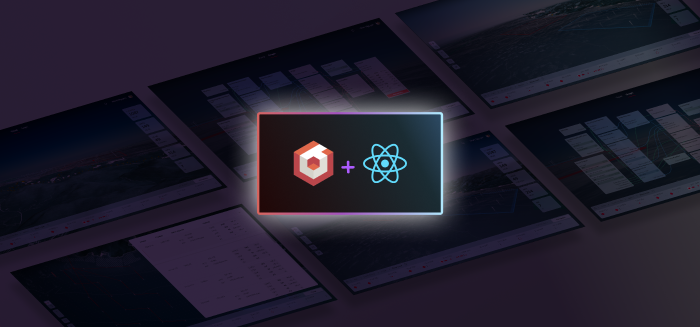

# BabylonJS + React Project Template 
A template project for creating 3D real-time web apps using BabylonJS and React.



DEMO > https://microsoft.github.io/BabylonJS-React-Template/

# Why Use This Project Template?
This projects provides a convenient starting point for building 3D web apps with either BabylonJS or Cesium.

It also serves as a reference for how a React/Babylon/Cesium/MSAL auth'd frontend can be setup, as you may prefer to set up a project without using this package.

This project was created with [`npx create-react-app`](https://reactjs.org/docs/create-a-new-react-app.html) and then [ejected](https://create-react-app.dev/docs/available-scripts/#npm-run-eject) 


# What's included:
* Webpack project, with:
  * [MSAL](https://github.com/AzureAD/microsoft-authentication-library-for-js) for AAD authentication
  * [Cesium](https://cesium.com/) dependencies for visualing geo-spatial data, with a sample scene to get started
  * [Babylon](https://www.babylonjs.com/) dependencies for rendering 3D content, with a sample scene to get started
  * [Redux Toolkit (RTK)](https://redux-toolkit.js.org/) for state management
* Build scripts for local deployment
* DevOps Build pipelines

# Getting Started
## Run locally
```bash
cd Apps/babylon-react-bootstrap.js
npm start
```

Navigate to http://localhost:3000

## Build
```bash
cd Apps/babylon-react-bootstrap.js
npm run build
```

## Guides
[How to configure Authentication](./AAD_AUTHENTICATION.md)


## Contributing

This project welcomes contributions and suggestions.  Most contributions require you to agree to a
Contributor License Agreement (CLA) declaring that you have the right to, and actually do, grant us
the rights to use your contribution. For details, visit https://cla.opensource.microsoft.com.

When you submit a pull request, a CLA bot will automatically determine whether you need to provide
a CLA and decorate the PR appropriately (e.g., status check, comment). Simply follow the instructions
provided by the bot. You will only need to do this once across all repos using our CLA.

This project has adopted the [Microsoft Open Source Code of Conduct](https://opensource.microsoft.com/codeofconduct/).
For more information see the [Code of Conduct FAQ](https://opensource.microsoft.com/codeofconduct/faq/) or
contact [opencode@microsoft.com](mailto:opencode@microsoft.com) with any additional questions or comments.

## Trademarks

This project may contain trademarks or logos for projects, products, or services. Authorized use of Microsoft 
trademarks or logos is subject to and must follow 
[Microsoft's Trademark & Brand Guidelines](https://www.microsoft.com/en-us/legal/intellectualproperty/trademarks/usage/general).
Use of Microsoft trademarks or logos in modified versions of this project must not cause confusion or imply Microsoft sponsorship.
Any use of third-party trademarks or logos are subject to those third-party's policies.
