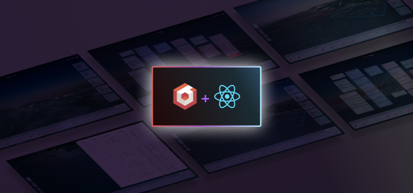

# BabylonJS + React Project Template 
A template project for creating 3D real-time web apps using BabylonJS and React.



DEMO > https://microsoft.github.io/BabylonJS-React-Template/

# Why Use This Project Template?
This project provides a convenient starting point for building 3D web apps with BabylonJS or Cesium.

It also serves as a reference for how to structure a React/Babylon/Cesium with MSAL authentication, for situations where you prefer setting up your own project.

The project is built on top of [Vite](https://vite.dev/) with TypeScript, React 19, Babylon.js 9 and Cesium.


# What's included:
* Vite + TypeScript project, with:
  * [MSAL](https://github.com/AzureAD/microsoft-authentication-library-for-js) for AAD authentication
  * [Cesium](https://cesium.com/) dependencies for visualising geo-spatial data, with a sample scene to get started
  * [Babylon](https://www.babylonjs.com/) dependencies for rendering 3D content, with a sample scene to get started
  * [Redux Toolkit (RTK)](https://redux-toolkit.js.org/) for state management
* Build scripts for local deployment
* DevOps Build pipelines

# Getting Started
## Prerequisites
Use Node.js 22.13 or newer in the Node.js 22 LTS line, or Node.js 24 or newer,
with npm. Node.js 20 is no longer supported by the current Cesium dependency.

## Run locally
```bash
npm ci           # install the versions recorded in package-lock.json
npm run dev      # or: npm start
```

Navigate to http://localhost:3000

## Build
```bash
npm run build    # tsc -b && vite build (output: dist/)
npm run preview  # preview the production build locally
```

## Other scripts
```bash
npm run typecheck  # TypeScript only, no emit
npm run lint       # ESLint
npm run audit      # all dependencies, including dev tools; fail on any known vulnerability
npx playwright install chromium
npm run test:e2e   # local browser smoke tests (requires WebGL)
```

## Dependency maintenance
Commit `package.json` and `package-lock.json` together when updating dependencies.
Run `npm run audit`, `npm run typecheck`, `npm run lint`, `npm run build`, and
`npm run test:e2e` after upgrades. The build pipeline uses `npm ci` and rejects
known vulnerabilities at every severity, including development dependencies.

TypeScript stays on the latest 6.0 patch because `typescript-eslint` currently
supports TypeScript versions below 6.1, not TypeScript 7. The Node.js type
definitions stay on the latest 22.x release to match the minimum supported
runtime. Other direct dependencies target their latest stable releases as of
September 24, 2026.

A clean npm audit means no known advisories were reported by the registry at
that time; it is not a guarantee that the application has no security defects.

## Guides
[How to configure Authentication](./AAD_AUTHENTICATION.md)
<!-- [How to build in Azure DevOps] -->
<!-- [] -->

## Contributing

This project welcomes contributions and suggestions.  Most contributions require you to agree to a
Contributor License Agreement (CLA) declaring that you have the right to, and actually do, grant us
the rights to use your contribution. For details, visit https://cla.opensource.microsoft.com.

When you submit a pull request, a CLA bot will automatically determine whether you need to provide
a CLA and decorate the PR appropriately (e.g., status check, comment). Simply follow the instructions
provided by the bot. You will only need to do this once across all repos using our CLA.

This project has adopted the [Microsoft Open Source Code of Conduct](https://opensource.microsoft.com/codeofconduct/).
For more information see the [Code of Conduct FAQ](https://opensource.microsoft.com/codeofconduct/faq/) or
contact [opencode@microsoft.com](mailto:opencode@microsoft.com) with any additional questions or comments.

## Trademarks

This project may contain trademarks or logos for projects, products, or services. Authorized use of Microsoft 
trademarks or logos is subject to and must follow 
[Microsoft's Trademark & Brand Guidelines](https://www.microsoft.com/en-us/legal/intellectualproperty/trademarks/usage/general).
Use of Microsoft trademarks or logos in modified versions of this project must not cause confusion or imply Microsoft sponsorship.
Any use of third-party trademarks or logos are subject to those third-party's policies.
